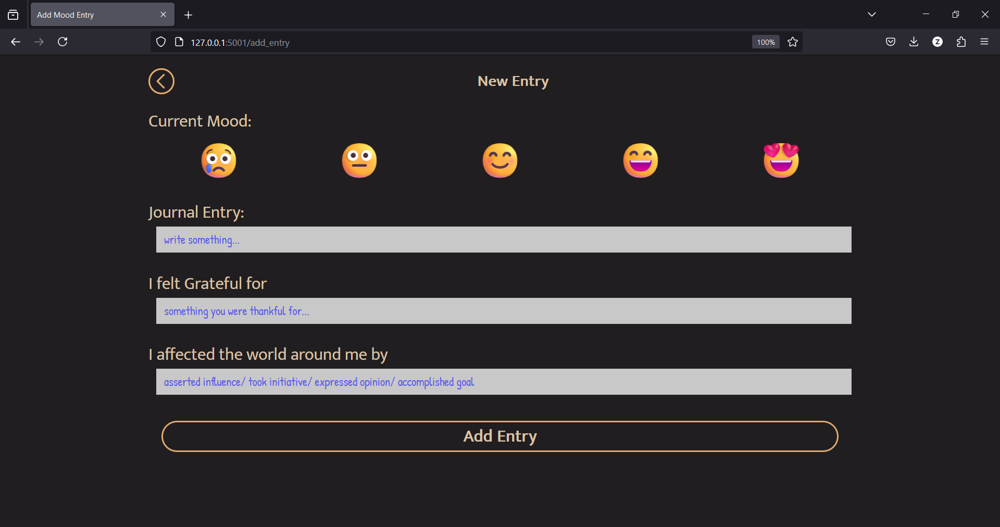

# ZenDiary
A comprehensive Flask-based web application that enables users to track and analyze their emotional well-being through daily mood journaling. The platform features secure user authentication, mood entry management, data visualization, and automated reporting.


## Key Features

- Secure user authentication with password hashing
- User profile management, including profile photo uploads
- Mood entry creation, editing, and deletion
- Natural language processing (NLTK) for journal entry analysis
- Visualizations like word clouds and charts to track mood trends
- Automated monthly mood report emails

## Technical Stack

- **Backend**: Python, Flask, SQLAlchemy, Flask-Login, Flask-Mail
- **Database**: MySQL
- **Data Analysis**: NLTK, Matplotlib, WordCloud
- **Frontend**: HTML, CSS, JavaScript
- **Additional**: APScheduler, Python-dotenv

## Installation and Setup

1. Clone the repository:
   ```
   git clone https://github.com/your-username/zendiary.git
   ```

2. Create a virtual environment and activate it:
   ```
   python -m venv venv
   source venv/bin/activate  # On Windows: venv\Scripts\activate
   ```

3. Install the required dependencies:
   ```
   pip install -r requirements.txt
   ```

4. Set up the environment variables:
   - Rename the `.env-example` file to `.env`
   - Update the values for several environment variables in the .env file

5. Initialize the database:
     - Open phpMyAdmin in your local environment
     - Create a new database named 'zendiary_db'
     - Click on the 'Import' tab
     - Choose the file `zendiary_db.sql` from the project root
     - Click 'Go' to import the database structure

6. Run the application:
   ```
   python run.py
   ```

   The application will be available at `http://localhost:5001/`.


## Screenshots

1. **Login Page**:
   

2. **Registration Page**:
   

3. **Home Page**:
   

3. **New Entry**:
   

5. **Analytics Page**:
   

6. **Word Cloud Page**:
   

## Contributing

If you'd like to contribute to the project, please follow these steps:

1. Fork the repository
2. Create a new branch for your feature or bug fix
3. Make your changes and commit them
4. Push your changes to your forked repository
5. Submit a pull request to the main repository
